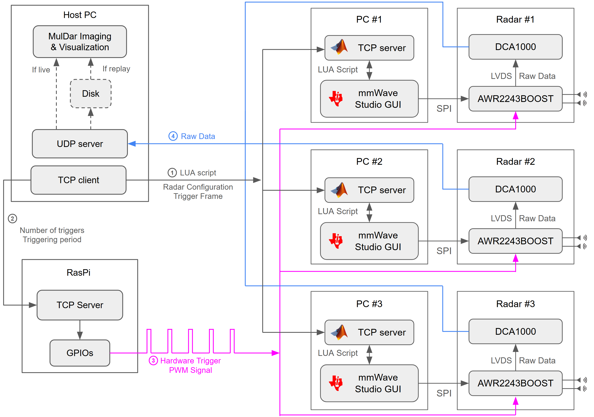

<h1 align="center">MulDar<br><sub>Unleashing the Potential of Distributed COTS mmWave Radar by Exploiting Cross-Device Channels</sub></h1>
<p align="center"><i>MobiSys 2026</i></p>

Multi-static COTS radar implementation built on TI AWR2243/1243BOOST and the DCA1000EVM, enabling distributed multi-view sensing and coherent processing across multiple radar nodes.

<p align="center">
  
</p>


## Installation

### Prerequisites

- Python 3.9+
- [uv](https://docs.astral.sh/uv/) (recommended) or pip
- CUDA-compatible GPU (required for CuPy)

### Setup

#### Using uv (recommended)

```bash
uv sync
```

#### Using Docker (only for result evaluations)

Requires [NVIDIA Container Toolkit](https://docs.nvidia.com/datacenter/cloud-native/container-toolkit/latest/install-guide.html) for GPU access.

```bash
docker build -t muldar .
docker run --gpus all -v $(pwd):/app -it muldar bash
```


This creates a virtual environment and installs all dependencies in one step. (Note: cupy may take longer time for installation)


## Hardware

<p align="center">
  
</p>

### How To:

For best flexibility and most control over the radars, each radar are connected (USB cables) to a separate PC the runs TI [mmWaveStudio](https://www.ti.com/tool/MMWAVE-STUDIO?utm_source=google&utm_medium=cpc&utm_campaign=epd-rap-null-58700008490712085_mmwave_studio_rsa-cpc-evm-google-ww_en_int&utm_content=mmwave_studio&ds_k=mmwave+studio&DCM=yes&gclsrc=aw.ds&gad_source=1&gad_campaignid=1757549268&gbraid=0AAAAAC068F2ATneWFn2fDkxtgO13YJrvh&gclid=Cj0KCQjwlqTRBhCBARIsANrkrxitKra_j--VQv9djisxuUGmAD2VMIUWTwZjYBHzWw9TbFeuovKM3kAaAhE5EALw_wcB) (version 03.00.00.14) since it can't run multiple instants on a single machine. Copy the `hardware/matlab` and `hardware/mmWaveStudio` folders to PCs, then run `connect_and_config.lua` in mmWaveStudio software. 

On those PCs, run MATLAB script `studio_server.m` for receiving radar commands (config radar, start frame, end frame) from the host computer, and it controls the TI mmWaveStudio following the official radar SDK. 

A Raspberry Pi 4B is used for simultanously triggering the hardware trigger of radars. It use this repo: https://github.com/xsun2445/WiringPi-Python-MultiPin for simultanously triggering GPIOs which are connected to the hardware triggers of AWR2243BOOST, which is pin 9 SYNC_IN on J5 connector, [doc](https://www.ti.com/lit/ug/spruit8d/spruit8d.pdf?ts=1781137898809&ref_url=https%253A%252F%252Fwww.ti.com%252Ftool%252FAWR2243BOOST). 

Note: R62 need to be removed for enabling SYNC_IN on AWR2243/1243BOOST, detailed SYNC_IN signal requirements are in 5.5.3 of mmwave_dfp_02_02_04_00 mmWave-Radar-Interface-Control.pdf that can be downloaded from TI. 

Each radar has a distinct ip for data and config port which can be configured using `scrips/config_dca_eeprom.py`. All radars, PCs, Raspberry Pi are connected to a single network switch used for communication and radar data transfering. Radar data from all 3 boards are streamed to the host computer and the host PC simultanously renders the scene for visualization.

Measure the `[x,y,yaw]` coordinates of those radars and write in the `configs.yml`, no need to be super precise. 

Then on host PC, run `scripts/radar_config.py`. It will config the starting frequency and transmitting/receiving for each of the radar through the MATLAB scripts on slave PCs. Run `play.py` with `visualize_2d_fft(mgr)`, it will show the beamforming images of all radar channels. Each colomn represents a transmitting antenna, each radar has 2 TX antennas so there will be 6 colomns in total. Each row represents a receiving radar, it shows a beamforming image using 4 RX antennas. Hence the diagonal beamforming images will always be stable since they are monostatic channels, but other images are bi-static channels which shows frequency offsets (the range profile will goes up and downs). 

Adjust the starting frequency of bi-static channels, then config and visualize again untill it shows solid peaks in all channels.


<p align="center">
  
  &nbsp;
  
</p>
<p align="center">
  <em>initial config</em>&emsp;&emsp;&emsp;&emsp;&emsp;&emsp;&emsp;&emsp;&emsp;&emsp;&emsp;&emsp;<em>after calibration</em>
</p>

Finally, run `play.py` with `start_visualization(mgr)` or `start_combined_visualization(mgr)`.

## Usage

```bash
python play.py
```

### Command-line options

| Option | Type | Description |
|---|---|---|
| `--config-path` | str | Path to YAML config file (default: `configs/config_new.yml`) |
| `--flag-save` / `--no-flag-save` | bool | Enable/disable data saving |
| `--flag-visualize` / `--no-flag-visualize` | bool | Enable/disable real-time visualization |
| `--wait-for-threads` / `--no-wait-for-threads` | bool | Wait for threads to finish |
| `--num-trigger` | int | Number of triggers |
| `--period-frame` | int | Frame period |
| `--radar-timeout` | int | Radar timeout |
| `--saving-root-dir` | str | Root directory for saved data |
| `--warmup` / `--no-warmup` | bool | Run warmup before acquisition |

By configuring the config.yml, radar stream can be played from either real radar or a recorded file.


## Evaluations 

### For single frame 
```bash
python scripts/single_frame_imaging.py
```

For more evaluations please refer to [evaluations/README.md](evaluations/README.md).


## Cite

If you find MulDar useful, please consider citing our MobiSys paper:

```bibtex
@inproceedings{sun2026muldar,
  author    = {Sun, Xinghua and Li, Qiancheng and Gadre, Akshay},
  title     = {MulDar: Unleashing the Potential of Distributed COTS mmWave Radar by Exploiting Cross-Device Channels},
  booktitle = {Proceedings of the 24th Annual International Conference on Mobile Systems, Applications and Services (MobiSys '26)},
  year      = {2026},
  doi       = {10.1145/3745756.3809206},
  publisher = {ACM},
  address   = {New York, NY, USA},
  month     = {June},
}
```


## Folder Structure

```
MulDar/
├── play.py                      # Main entry point for data acquisition
├── configs.yml                  # Default configuration file
├── pyproject.toml               # Python project & dependency config
├── uv.lock                      # Dependency lock file
├── Dockerfile                   # Docker build file
├── LICENSE
│
├── src/muldar/                  # Core library package
│   ├── configs.py               # Configuration loading & dataclasses
│   ├── utils.py                 # Utility functions
│   ├── devices/                 # Hardware device interfaces
│   │   ├── muldar.py            # Multi-radar system controller
│   │   ├── radar.py             # Single radar (DCA1000EVM) interface
│   │   └── motor.py             # Motor control for SAR scanning
│   ├── dsp/                     # Digital signal processing
│   │   ├── dsp.py               # Core DSP pipeline (range/Doppler FFT)
│   │   ├── bistatic.py          # Bistatic radar processing
│   │   ├── sar.py               # SAR imaging algorithms
│   │   ├── cfar.py              # CFAR detection
│   │   └── music.py             # MUSIC algorithm
│   ├── vis/                     # Visualization
│   │   ├── vis.py               # Plotting utilities
│   │   └── network_vis.py       # Radar network visualization
│   └── eval/                    # Evaluation metrics
│       └── chamfer.py           # Chamfer distance metric
│
├── scripts/                     # Standalone utility scripts
│   ├── calibration.py           # Radar calibration
│   ├── config_dca_eeprom.py     # DCA1000 EEPROM configuration
│   ├── radar_config.py          # Radar parameter configuration
│   └── single_frame_imaging.py  # Single-frame imaging script
│
├── evaluations/                 # Evaluation experiments
│   ├── download_dataset.py      # Dataset download script
│   ├── car/                     # Car imaging evaluation
│   ├── chamfer/                 # Chamfer distance evaluation
│   └── common_objects/          # Common object imaging evaluation
│
├── hardware/                    # Hardware resources
│   ├── antenna.ipynb            # Antenna pattern analysis
│   ├── listen_trigger.py        # Trigger listener for sync
│   ├── cadmodels/               # 3D-printable CAD models (.stl)
│   ├── matlab/                  # MATLAB scripts for mmWaveStudio
│   │   ├── mmWaveStudio/        # Lua configs for AWR1243/2243
│   │   ├── studio_server.m      # MATLAB-mmWaveStudio bridge
│   │   └── *.m                  # RSTD connection scripts
│   └── radar/                   # Radar config templates
│
├── adcData/                     # Raw ADC data (not tracked in git)
│   ├── car/                     # Car scene captures
│   ├── curve/                   # Curved surface captures
│   ├── deformable/              # Deformable object captures
│   ├── drywall/                 # Drywall captures
│   ├── fabrics/                 # Fabric captures
│   ├── metal/                   # Metal surface captures
│   ├── plastic/                 # Plastic surface captures
│   ├── real_object/             # Real object captures
│   └── wood/                    # Wood surface captures
│
└── assets/                      # README images
```
